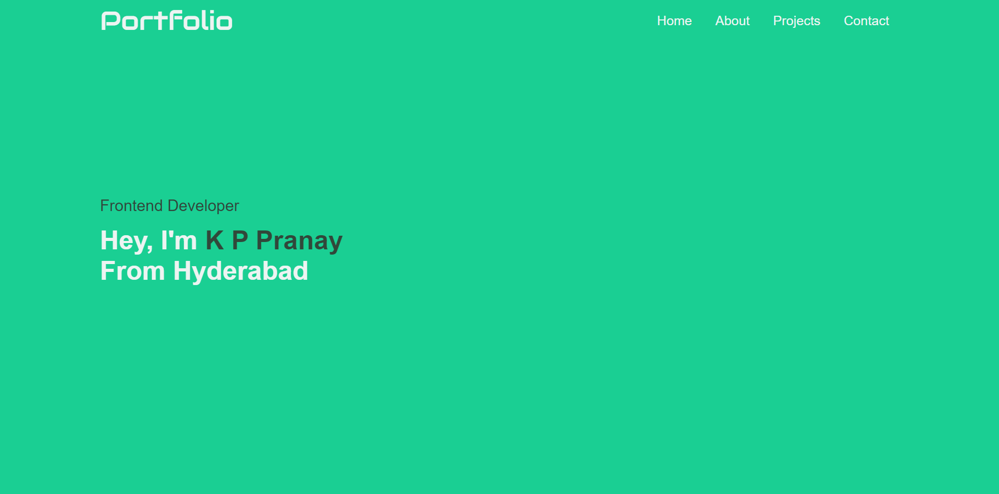
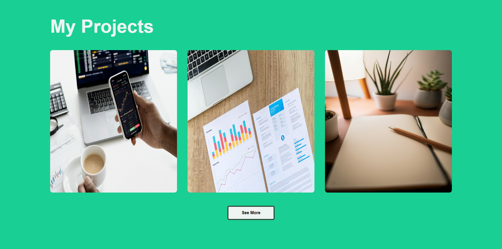
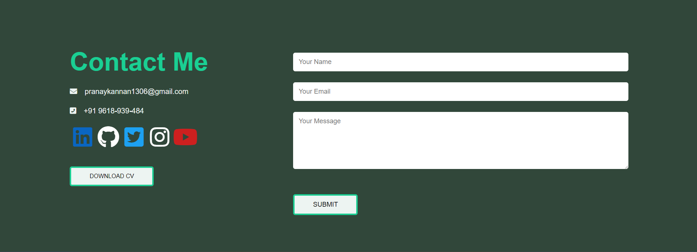

# Personal Portfolio Website








This is my **Personal Portfolio Website**, built using **HTML**, **CSS**, and **JavaScript**. It showcases my skills, projects, and contact information in a modern, responsive design.

## 🚀 Features

- **Responsive Design**: The site is fully responsive and works well across different devices.
- **Smooth Navigation**: Sticky navigation bar with smooth scrolling.
- **Interactive Portfolio**: Projects section showcasing my work with links to GitHub repositories.
- **Contact Form**: A functional contact form connected to Google Sheets using Google Apps Script for form submissions.
- **Downloadable Resume**: CV download link.

## 🛠️ Technologies Used

- **HTML5**
- **CSS3**
  - Flexbox, Grid, and custom animations
- **JavaScript**
  - DOM Manipulation, Event Handling
- **Google Apps Script**
  - For the contact form submissions

## 📝 Sections

- **Home**: Introduction and brief description.
- **About Me**: A summary of my skills, achievements, and educational background.
- **Projects**: A showcase of my projects with live demos and GitHub links.
- **Contact**: A contact form for direct communication and links to my social profiles.

## 📂 Project Structure

```bash
├── images/                # Images used in the website
├── index.html             # Main HTML file
├── style.css              # Main CSS file
├── script.js              # Main JavaScript file for interactivity
├── Resume.pdf             # Resume for download
└── README.md              # Project README
